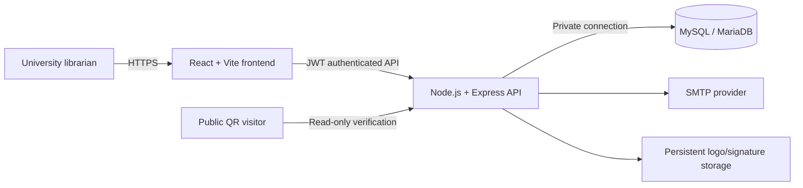

# University Library Management System

A full-stack library administration platform for managing students, physical book copies, circulation, fines, reminders, reports, and verifiable student clearance certificates.

The application is designed for university library staff. It combines a React administration interface with an authenticated Express API and a MySQL/MariaDB database. Catalog fields, institutional branding, circulation policy, administrator accounts, and clearance-letter content can be managed from the application settings.

> **Release status:** the main workflows are implemented and have passed the automated and browser checks described below. The repository is ready for staging deployment. Complete the production checklist before loading real university data or exposing the service publicly.

## Core capabilities

| Module | Available functionality |
| --- | --- |
| Dashboard | Live circulation totals, recent issues, recent fines, and monthly activity |
| Students | Manual add/edit/view, server-side search and pagination, configurable fields, and CSV import/export |
| Books | One record per physical accession, availability and history, configurable fields, and CSV import/export |
| Circulation | Student/book lookup, eligibility checks, configured loan limits and periods, concurrent issue protection, and atomic returns |
| Fines | Automatic overdue fines, manual fines, Paid/Waived resolution, Accounts handoff, CSV export, and audited removal |
| Fine Trash | Complete deleted-fine snapshots, deletion reason and administrator identity, with automatic permanent removal after 90 days |
| Clearance | Live obligation checks, pending reports, versioned A4 PDF certificates, QR verification, immutable history, and revocation |
| Reports | Issuing, overdue, fine, department, Accounts Office, analytics, CSV, and Excel reporting |
| Reminders | Overdue-recipient review and administrator-triggered SMTP email delivery |
| Settings | Branding, logo, loan/fine policy, field layouts, clearance templates, and administrator accounts |
| Backup | Authenticated data-only SQL and CSV downloads |

## Key business rules

- An accession number represents one physical book copy and cannot be actively issued to two students.
- Inactive, suspended, and graduated students cannot borrow books.
- The backend applies the configured maximum-book limit, loan period, fine rate, and library timezone.
- Issuing uses database locks so simultaneous requests cannot exceed a student's limit or lend the same copy twice.
- Returning a book and creating its overdue fine occur in one transaction.
- Student imports treat a matching normalized name, registration number, and email as a duplicate. A shared name alone does not identify the same student.
- Imports preview Ready, Duplicate, Conflict, and Invalid rows before insertion and never overwrite existing records.
- A clearance certificate can be issued only when the student has no active issues and no unresolved fines.
- Issued clearance PDFs retain their template, student, eligibility, administrator, and integrity snapshots. Later template edits do not change existing certificates.
- Sending a fine to Accounts does not mark it Paid or Waived.
- Removing a fine preserves its complete audit snapshot in Fine Trash for 90 days.

## Architecture



| Layer | Technology | Responsibility |
| --- | --- | --- |
| Frontend | React 18, TypeScript, Vite 6, Tailwind CSS, Material UI | Administration screens and public clearance verification |
| Backend | Node.js, Express 5 | Authentication, validation, business rules, transactions, exports, email, and PDFs |
| Database | MySQL through `mysql2`; MariaDB compatible | Students, books, issues, fines, layouts, settings, administrators, and clearance history |
| Authentication | bcrypt and JWT | Hashed administrator passwords and protected business API routes |
| Documents | PDFKit and QRCode | A4 clearance certificates, pending reports, and public verification links |
| Data exchange | CSV Parser and ExcelJS | Previewed imports and CSV/Excel exports |

## Repository structure

```text
library-system/
├── src/                         React application
│   ├── app/components/pages/    Dashboard and administration modules
│   └── lib/                     API and configurable-field clients
├── server/
│   ├── controllers/             Student request handlers
│   ├── lib/                     Catalog, policy, import, fine, and clearance rules
│   ├── middleware/              JWT authentication
│   ├── routes/                  Express API routes
│   ├── scripts/                 Schema and administrator setup
│   └── tests/                   Unit and MariaDB integration tests
├── RAILWAY_DEPLOYMENT.md        Railway service, variables, and launch checklist
├── CLEARANCE_MODULE.md          Clearance workflow and template reference
├── FIELD_LAYOUTS.md             Configurable student/book field behavior
├── MODULE_SETUP.md              Student, book, issue, return, and test details
└── DEPLOYMENT_REVIEW.md         Readiness review and production requirements
```

## Local setup

### Requirements

- Node.js 18 or newer
- npm
- MySQL 8 or MariaDB 10.4 or newer

### 1. Install dependencies

```bash
npm install
npm --prefix server install
```

### 2. Create a database

Create an empty database and a dedicated application user. The API initializes missing tables and applies additive schema updates when it starts.

```sql
CREATE DATABASE library_system
  CHARACTER SET utf8mb4
  COLLATE utf8mb4_unicode_ci;

CREATE USER 'library_app'@'localhost' IDENTIFIED BY 'replace-with-a-strong-password';
GRANT SELECT, INSERT, UPDATE, DELETE, CREATE, ALTER, INDEX
  ON library_system.* TO 'library_app'@'localhost';
FLUSH PRIVILEGES;
```

### 3. Configure environment files

Copy `server/.env.example` to `server/.env`, then set the real database, JWT, administrator-seeding, and optional SMTP values. Keep `server/.env` private; it is ignored by Git.

Copy the root `.env.example` to `.env` and set the API address used by the frontend:

```env
VITE_API_URL=http://localhost:5000
```

Backend variables:

| Variable | Purpose |
| --- | --- |
| `DB_HOST`, `DB_PORT` | Database network location |
| `DB_USER`, `DB_PASSWORD`, `DB_NAME` | Restricted application database credentials |
| `JWT_SECRET`, `JWT_EXPIRE` | Administrator session signing and lifetime |
| `ADMIN_NAME`, `ADMIN_EMAIL`, `ADMIN_PASSWORD` | Used only by the administrator seed command |
| `SMTP_HOST`, `SMTP_PORT`, `SMTP_USER`, `SMTP_PASS` | Reminder and Accounts email delivery |
| `LIBRARY_TIMEZONE` | Business-date timezone; defaults to `Asia/Karachi` |
| `PORT` | API port; defaults to `5000` |
| `NODE_ENV` | Runtime environment |

Use a long, randomly generated `JWT_SECRET`. Do not reuse the database password, SMTP password, or an administrator password.

### 4. Create the first administrator

After setting `ADMIN_EMAIL` and `ADMIN_PASSWORD` in `server/.env`:

```bash
npm --prefix server run seed:admin
```

Passwords must contain at least 12 characters. Passwords are stored as bcrypt hashes; plaintext credentials are not committed to this repository.

### 5. Run the application

Start the API from the repository root:

```bash
npm start
```

In a second terminal, start the frontend:

```bash
npm run dev
```

Open the local URL printed by Vite and sign in with the administrator account created above.

## CSV imports

Students and Books each provide a layout-aware CSV template and an import preview. Download a fresh template after changing fields in Settings.

- File type: CSV UTF-8
- Maximum file size: 5 MB
- Maximum records: 10,000
- Maximum size per record: 128 KB
- Existing rows are never silently updated
- Database failure rolls back the complete confirmed batch
- Registration numbers, contacts, accessions, and ISBNs should be formatted as text in spreadsheet software to preserve leading zeroes

See [MODULE_SETUP.md](MODULE_SETUP.md) for identity and conflict examples and [FIELD_LAYOUTS.md](FIELD_LAYOUTS.md) for custom-field behavior.

## Verification

Run the unit tests:

```bash
npm --prefix server test
```

Run integration tests against a disposable local MySQL/MariaDB instance:

```bash
TEST_DB_PORT=3306 npm --prefix server run test:integration
```

On PowerShell:

```powershell
$env:TEST_DB_PORT = "3306"
npm --prefix server run test:integration
```

The integration runner connects only to `127.0.0.1`, creates a uniquely named `library_module_test_...` database, and removes that database afterward. It does not read production credentials from `server/.env`.

Current release verification:

- Frontend production build: passed
- Backend unit tests: 16 passed
- MariaDB integration tests: 55 passed
- Administrator browser workflows: passed
- Frontend production dependency audit: zero known vulnerabilities
- Backend production dependency audit: zero known vulnerabilities

The integration coverage includes imports, duplicate handling, transaction rollback, simultaneous issues and returns, search and pagination, fine resolution, 90-day Fine Trash retention, administrator accounts, backups, clearance issuance/verification/revocation, and unauthenticated API rejection.

## Deployment model

A practical Railway arrangement is:

| Component | Recommended host | Configuration |
| --- | --- | --- |
| Frontend and backend | Railway | The Docker image builds React and serves it from Express on one HTTPS domain |
| Database | Railway MySQL | Use the private database hostname from the backend service; do not expose the database publicly |
| Uploaded branding | Railway volume mounted at `/data` | Set `UPLOAD_DIR=/data/uploads` to preserve institution logos and signatures |
| Email | University SMTP or another SMTP provider | Store credentials only in backend environment variables |

The browser must communicate with the API over HTTPS. The database should accept connections only from the backend service or an approved administration path; the frontend never receives database credentials.

### Production checklist

Before using real university records:

- Restrict API CORS to the deployed frontend domain.
- Generate new production database credentials and a strong JWT secret.
- Keep the managed database private and require encrypted database connections where supported.
- Place uploaded logos and signatures on persistent storage.
- Set the public verification website so clearance QR codes use the final HTTPS domain.
- Configure and test SMTP delivery, failure reporting, and sender identity.
- Create the first production administrator through the seed command, then remove seed credentials from the service environment.
- Restore a data backup into an empty staging installation and reconcile record counts and login access.
- Configure database backups, service health checks, restart policy, logs, monitoring, and retention.
- Decide whether the university requires librarian, administrator, and Accounts roles. Current accounts have full administrator access.
- Obtain approval for official clearance wording, signatory, logo, and signature.

The authenticated SQL download is a data export. It does not replace managed database backups or a tested disaster-recovery process.

## Security and privacy

- Business endpoints require a valid administrator session; login, public branding, logo files, and read-only clearance verification are deliberately public.
- Administrator passwords use bcrypt hashes.
- Password changes invalidate earlier tokens.
- Login attempts are rate-limited.
- The frontend stores no database credentials.
- Fine removal and clearance revocation retain administrator identity and required reasons.
- Secrets belong in hosting-provider environment variables, never in Git commits or frontend variables.
- Real student data should never be copied into test fixtures, issue reports, or public repository files.

Role-based authorization and two-factor authentication are not implemented. Review [DEPLOYMENT_REVIEW.md](DEPLOYMENT_REVIEW.md) before a production launch.

## Project documentation

- [Module setup and verified workflows](MODULE_SETUP.md)
- [Railway deployment guide](RAILWAY_DEPLOYMENT.md)
- [Configurable field layouts](FIELD_LAYOUTS.md)
- [Student clearance module](CLEARANCE_MODULE.md)
- [Deployment readiness review](DEPLOYMENT_REVIEW.md)
- [Third-party attributions](ATTRIBUTIONS.md)

## Acknowledgment

Project supervisor: **Mudassar Khan**.
